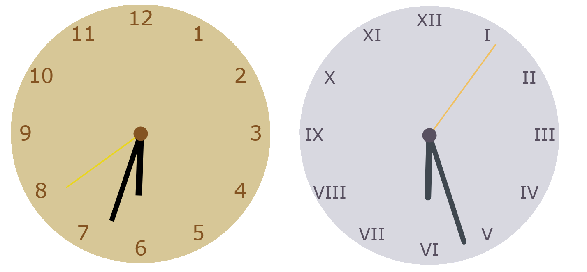

# jsClock

Simple clock developed in javascript, customizable with several themes

### Settings

Several settings are possible in the *js/setting* file. 

Size variables like *numbers-size* are from 1 to 10.

Every hexadecimal colors are possible.

Boolean variables like "roman-numbers" are 1-show or 0-hide

